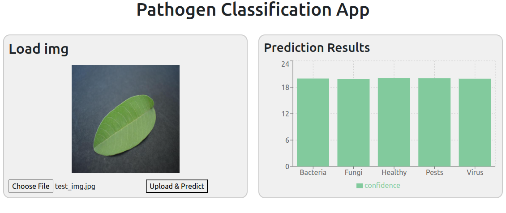

# 🌿 Pathogen Classification

This project involves a machine learning model that classifies leaves based on their health status. The model predicts whether a leaf is infected by bacteria, fungi, pests, or viruses, or if it is healthy. The model is trained using **TensorFlow** and optimized with **Keras Tuner** to find the best parameters. A **Flask API** is used to serve the model, while a **React frontend** allows users to upload leaf images and visualize the classification results with a probability bar chart.

## 💼 Situation

I was contracted by an agri-tech company that provides digital tools for farmers, aiming to reduce the reliance on manual diagnosis and speed up disease detection in crops. The company wanted a solution to help farmers—especially those in remote areas—quickly identify plant diseases from leaf images. The objective was to develop a simple, fast, and accessible tool for disease classification, offering real-time predictions with a user-friendly interface.

The problem: Manual diagnosis of plant diseases is time-consuming and requires expertise that is not always available in remote areas.

The solution: I developed a tool that automates the classification of plant diseases using a machine learning model, which can be easily accessed and used by farmers to quickly identify the health of their crops.

## 🛠️ Technologies Used

- **Machine Learning**: TensorFlow, Keras Tuner (for hyperparameter optimization)
- **Backend**: Flask (to serve the model and handle image uploads)
- **Frontend**: React (to create a user interface for image upload and result display)
- **Testing**: Postman (for API testing), pytest (for backend unit tests)
- **Version Control**: Git (for code management)

## 🔑 Key Features

- 📸 **Upload Leaf Images**: Users can upload an image of a leaf for classification.
- 📊 **Classification Results**: View the classification results as a bar chart, showing the probability of the leaf belonging to each disease category (bacteria, fungi, pests, virus, or healthy).
- ⚡ **Fast Predictions**: Real-time predictions are made using a trained machine learning model.
- 🔒 **API Testing**: The API is tested using Postman for proper functionality, and unit tests are written with pytest.

## 📈 Model Summary

The model architecture consists of several layers, including rescaling, flattening, and dense layers. Here’s an overview:

| Layer (type)       | Output Shape         | Param #       |
|--------------------|---------------------|--------------|
| rescaling (Rescaling) | (None, 256, 256, 3) | 0            |
| flatten (Flatten)  | (None, 196608)       | 0            |
| dense (Dense)      | (None, 73)           | 14,352,457   |
| dense_1 (Dense)    | (None, 73)           | 5,402        |
| dense_2 (Dense)    | (None, 5)            | 370          |

## 🗂️ Project Structure

### Backend
- **`/backend/api`**: Contains the Flask API, which receives image upload requests and returns classification results.
- **`/backend/models`**: Stores the model weights for making predictions.
- **`/backend/test`**: Includes unit tests for the Flask API, ensuring correct functionality and error handling.
- **`/backend/utils`**: Utility functions for image preprocessing and loading.
- **`/backend/venv`**: Python virtual environment for managing dependencies.

### Frontend
- **`/frontend/src/components`**:
  - **`Header`**: Displays the app title and navigation.
  - **`ImageUpload`**: Manages image uploads and displays the image.
  
  - **`ShowResults`**: Displays classification results with probabilities.
- **`/frontend/src/provider`**: Contains the `PredictionContext` for managing and passing predictions.
- **`/frontend/src/services`**: Handles communication with the Flask API to send image data and retrieve results.

### Model Training
- **`/train_model/`**:
  - **`dataset`**: Contains the dataset used to train the model.
  - **`logs`**: Stores logs for the training process.
  - **`train_notebook.ipynb`**: Jupyter notebook for model training, hyperparameter tuning, and evaluation.

## ⚙️ Installation and Setup

### Backend Setup
1. Clone the repository:
    ```bash
    git clone <repository-url>
    cd backend
    ```
2. Set up the virtual environment:
    ```bash
    python -m venv venv
    source venv/bin/activate   # On Windows: `venv\Scripts\activate`
    ```
3. Install dependencies:
    ```bash
    pip install -r requirements.txt
    ```
4. Run the Flask app:
    ```bash
    python app.py
    ```

### Frontend Setup
1. Navigate to the frontend directory:
    ```bash
    cd frontend
    ```
2. Install dependencies:
    ```bash
    npm install
    ```
3. Start the React app:
    ```bash
    npm start
    ```

### Model Training
1. Navigate to the `train_model` directory:
    ```bash
    cd train_model
    ```
2. Open and run the `train_notebook.ipynb` to train the model.

## 🧪 Testing

- **Postman**: Use Postman to send a `POST` request to the `/predict` endpoint with an image file for classification.
- **pytest**: Run unit tests for the backend API:
    ```bash
    pytest
    ```

## 🚀 Future Improvements

- **Docker**: Create a Docker container for easy deployment of both the frontend and backend services.
- **Model Performance Evaluation**: Add functionality to evaluate the model performance, such as calculating accuracy, F1 score, and confusion matrix, to ensure the model’s effectiveness.
- **Scalability**: Implement multi-threading or background task processing to handle larger image datasets and improve performance.
- **User Authentication**: Implement authentication and authorization features for more personalized access to the tool.
- **UI/UX**: Improve the frontend interface with advanced design features to enhance user experience, including interactive features or additional data visualization.

## ⚠️ Disclaimer

This project is part of my learning journey with various technologies, including machine learning, backend development, and frontend frameworks. The model's accuracy is not the primary focus, as the project aims to practice using TensorFlow, Flask, React, and other tools. 